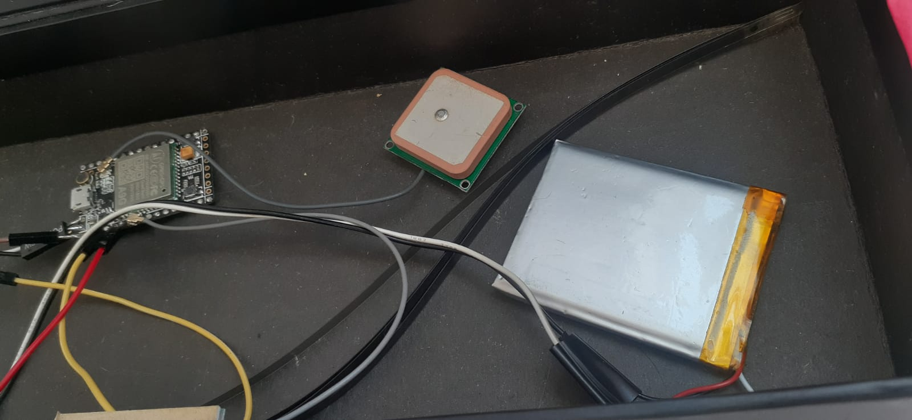
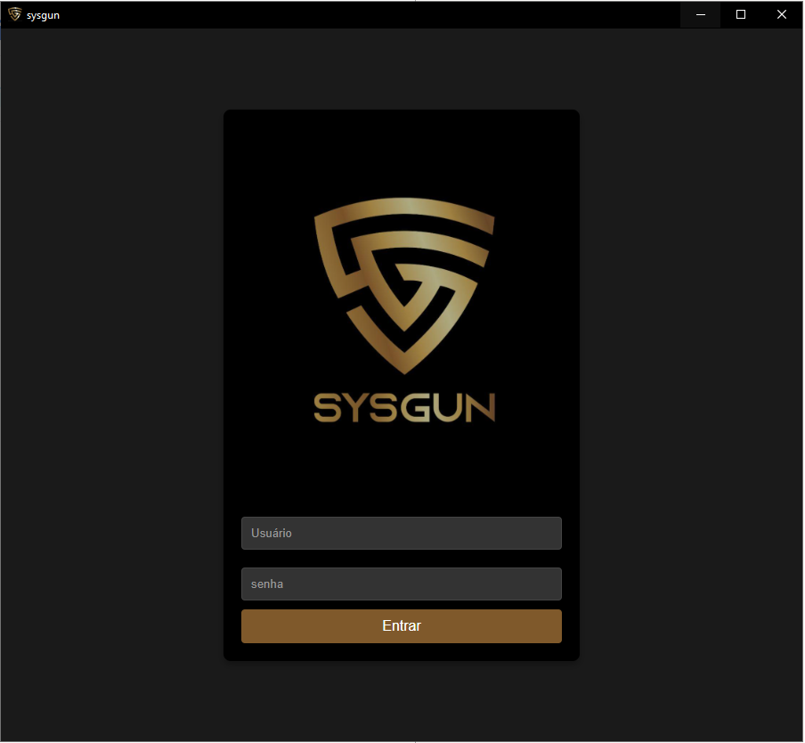
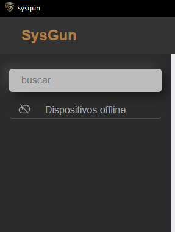
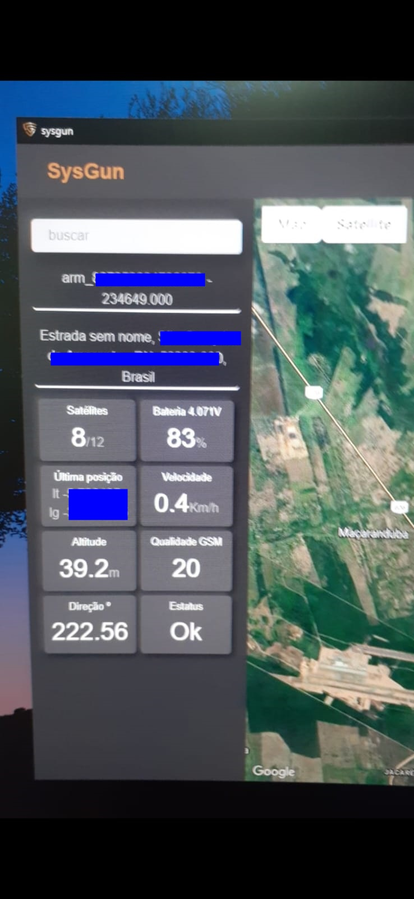

- Desenvolvedor

## Sobre mim

Sou um desenvolvedor de software com foco em backend, mas com conhecimentos em frontend e outras áreas da tecnologia, como IoT e Automação. Trabalho com Python e suas diversas tecnologias há mais de seis anos, atuando desde a integração de sistemas até a criação de aplicações web. 

Também utilizo a AWS e muitos dos seus serviços diariamente há mais de cinco anos, construindo aplicações serverless ou como auxiliares/extensão de outros sistemas internos das empresas.

### Minha trajetória

Iniciei oficialmente minha carreira como desenvolvedor em 2017, atuando no backend de aplicações web e na criação de sites. Durante minha trajetória, tive a oportunidade de desenvolver o setor de TI de uma empresa, onde atuei por mais de seis anos, implementando soluções escaláveis, garantindo a eficiência dos sistemas e livrando muitas pessoas do trabalho manual entediante. 

Além disso, realizei projetos como desenvolvedor freelancer em diversas tecnologias (desde IoT até IA), ampliando minha experiência e enfrentando diferentes desafios.

Raramente me empenhei na realização de cursos (embora não os descarte). Acredito que o melhor curso de tecnologia são as documentações oficiais e a prática constante no dia a dia.

## Experiência Profissional

### 2024: Desenvolvedor Backend | Poeme
**Tecnologias:** AWS, Whatsapp (API Cloud Oficial da Meta), Chatbot, Python e IA, Cloud Architect.

### 2019-2025: Desenvolvedor Backend | Mirantes Empreendimentos
**Tecnologias:** AWS, Python, JavaScript, Rust, TypeScript, Google Appsheet, entre outras.  
(Atuação focada em integração de sistemas - Financeiro, engenharia e Marketing)  
[https://soumirantes.com.br/](https://soumirantes.com.br/)

### 2018-2019: Desenvolvedor Backend | Rits Tecnologia
**Tecnologias:** AWS, Laravel (PHP), Redis, Vue.js, etc. 
[www.rits.com.br](https://www.rits.com.br)

## Outros Projetos

### 2023: (IoT) Sistema de Rastreamento por GPS
**Tecnologias:** Rust, C, C++, AWS, Sockets, JavaScript, TypeScript, React.js, MQTT

### 2022: (Curso LGPD): Participação em Treinamento de LGPD pela ATTO Consultoria e Treinamento

## Projetos Pessoais e links
- *[LinkedIn](https://www.linkedin.com/in/sillassilveira/)*
- *[Github](https://github.com/sillas)*
- *[2017 - Desk Lamp With Arduino (Youtube)](https://www.youtube.com/watch?v=gr-CEdU2xXM)*
- *[2017 - Blender + OpenCV (Youtube)](https://www.youtube.com/watch?v=rvZ0Yy4kTi0)*
- *[2017 - Blender + Arduino (Youtube)](https://www.youtube.com/watch?v=6UIN_hI7L8w)*
- *[2015 - Intel Galileo Gen 1 + Python (Youtube)](https://www.youtube.com/watch?v=O_nYzcCUpAo)*

---

📫 Entre em contato:  
[sillassamyr@gmail.com](mailto:sillassamyr@gmail.com)
